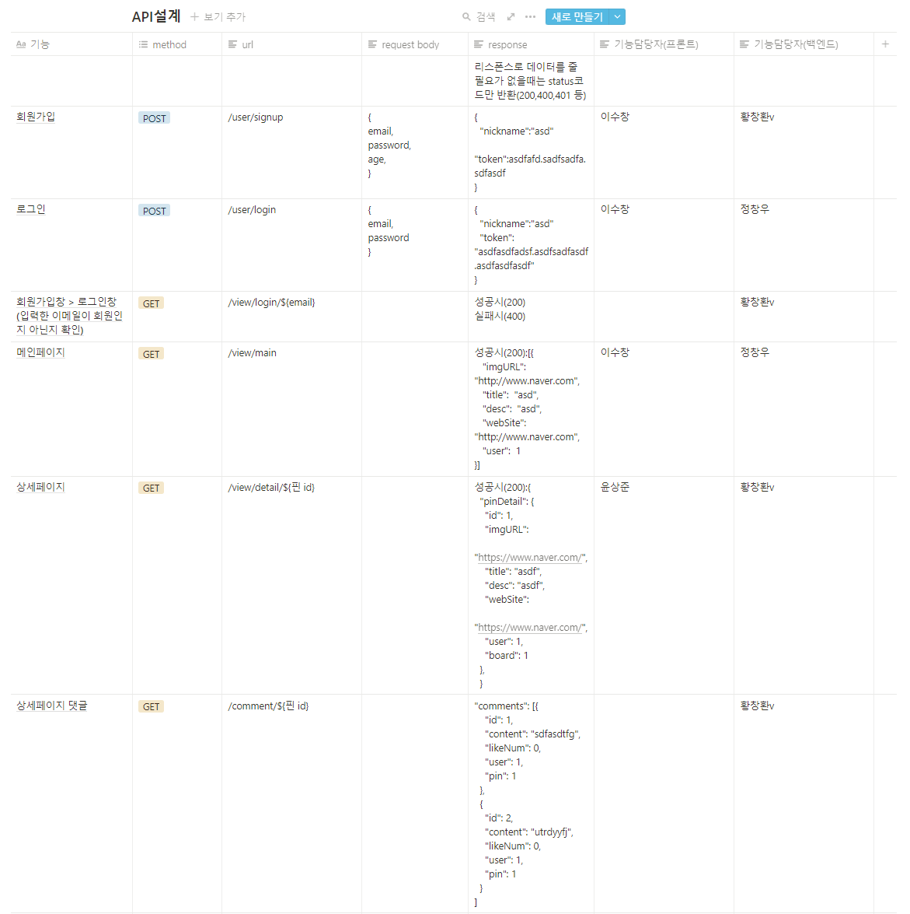
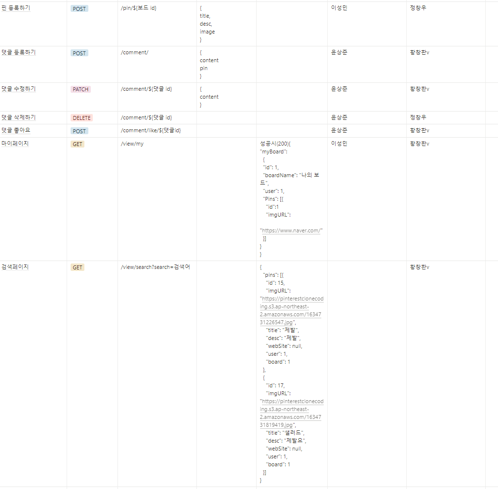

# 항해99 클론코딩

## Pinterest

## 인원
[프론트](https://github.com/highjoon/pinterest-clone-frontend)
 - 윤상준 [(깃허브 바로가기)](https://github.com/highjoon)
 - 이성민 [(깃허브 바로가기)](https://github.com/sungminleeme)
 - 이수창 [(깃허브 바로가기)](https://github.com/eternalclash)

[백엔드](https://github.com/changchanghwang/pinterest-clone-backend)
 - 정창우 [(깃허브 바로가기)](https://github.com/changpro1)
 - 황창환 [(깃허브 바로가기)](https://github.com/changchanghwang)
## SCOPE
로그인/회원가입

이미지 기반 핀 CRUD, 

마이페이지

댓글 + 좋아요

검색기능

## 공통

회원가입시 제약조건

빈값 x

이메일 :이메일 형식에 맞게 @앞에 3글자 이상

비밀번호: 8자이상, 영어 대소문자, 숫자가능

나이: 숫자만 가능
## 프론트

- **메인페이지 [수창]**
    - 헤더 검색
- **상세페이지 [상준]**
    - 외부 링크
    - 댓글 (대댓글은 추가로)
    - 좋아요
- **로그인 및 회원가입 페이지 [수창]**
- 핀만들기 **[성민]**
    - 이미지 업로드
- **마이페이지 [성민]**
    - 나만의 보드
## 백엔드

database : MySQL

패키지 설치시 상대한테 알려주기

### 라이브러리
라이브러리 | 설명
---|:---:
 | 비밀번호 암호화
 | 교차 리소스 공유
  | 아마존 서비스 연결
  | 파일 업로드
  | s3 파일 업로드
  | 환경변수 관리
 | 서버
  | 입력데이터 검출
  | 서명 암호화
 | Http Log 기록
  | 데이터베이스
  | MySQL ORM
 | MySQL ORM Console
 | API 문서화

## API설계

## DB설계

## 깃 규칙

내가 작업중인데 다른사람이 PR(pull request) 한 상황
1. 일단 내거 add후commit 
2. git checkout mater
3. git pull origin master
4. git checkout (본인브랜치 ex:sungmin)
5. git merge master (이상황에서 충돌 날수도 있음. 완료하면 메시지쓰고 esc키, :wq 입력 후 엔터)
6. 이제 로컬의 내 브랜치는 최신의 master을 가져온것을  작업하는 것입니다.
   
참고로 위 5번에서 merge해도 되고 rebase해도 된다. 둘다 충돌이 생길 경우 해결해야 하는 건 똑같다

본인이 작업 한 것을 올 릴경우

1. add > commit > git push origin 본인브랜치
2. 깃헙에 가서 PR를 한후 Merge버튼을 누른다(머지를 해야 본인 브랜치에 올린 파일이랑 master이랑 합쳐짐)
3. merge한후에 터미널로가서 git checkout main
4. git pull( 깃헙에있는 master이랑 로컬에있는 master내용이 차이나기때문)
5. git checkout 본인브랜치로 가서 다시 작업을 시작

git 오류

- Pull is not possible because you have unmerged files 라고 뜨면 git commit -am '커밋메시지' 최근 커밋된 메세지를 삭제하면 됨
- ! [rejected]        main -> main (fetch first)
error: failed to push some refs to '[https://github.com/sungminleeme/Sparta.git](https://github.com/sungminleeme/Sparta.git)'
hint: Updates were rejected because the remote contains work that you do
hint: not have locally. This is usually caused by another repository pushing
hint: to the same ref. You may want to first integrate the remote changes
hint: (e.g., 'git pull ...') before pushing again.
hint: See the 'Note about fast-forwards' in 'git push --help' for details.
- 해당 에러는 원격저장소와 현재 작업중인 로컬저장소가 동기화되지 않았을 때 발생한다. 동기화되지 않은 상태에서 다시 push하면 데이터가 소실될 수 있어 하고 경고해주는 것.

- 해결방안
- 동기화를 위해 pull  >>  git pull origin main
- 강제로 push >> git push origin +main(덕분에 2시간 Readme 정리한것 다 날아 감ㅜㅜ)

강제로 푸쉬하면 그전에 변경사항은 다 삭제하니까 진짜로 주의해야됨!

### 커밋 컨벤션
- 프론트앤드
    
    Add: 추가
    
    Update:수정
    
    Fix:완료
    

- 백엔드
    
    feat:새로운기능추가
    
    fix:버그 수정
    
    docs:문서 수정
    
    style:코드 포맷팅, 세미콜론 누락, 코드변경이 없는 경우
    
    refactor:코드 리팩토링test:테스트 코드, 리팩토링 테스트 코드 추가
    
    chore:빌드 업무 수정, 패키지 매니저 수정
    
    > 제목은 50자 미만, 문장의 끝에 마침표 넣지 않음 과거 시제 사용하지 않고 명령어로 작성제목 외에 추가적으로 정보를 전달하고 싶을 경우 본문에 추가 정보 기입예시 : [feat] comment CRUD 기능 추가
